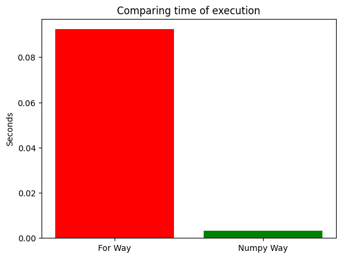
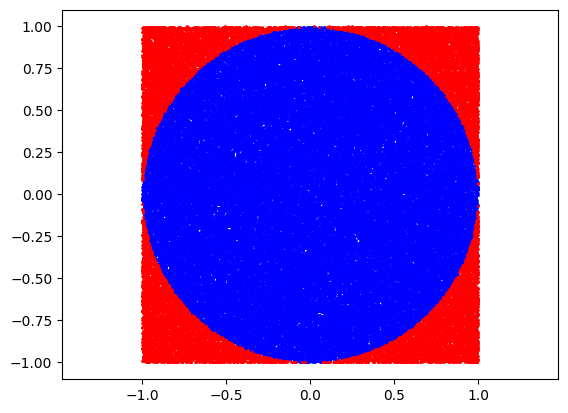
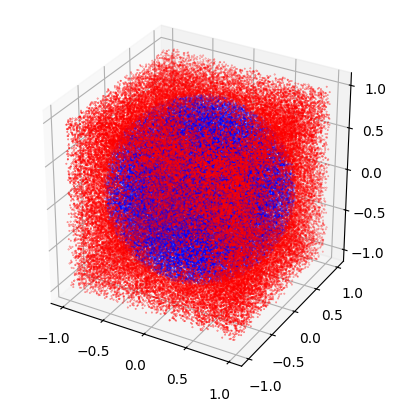

# 🎯 Monte Carlo Pi Estimator (2D & 3D) & NumPy Benchmark

A computational physics and data engineering project that estimates the value of Pi ($\pi$) using the Monte Carlo method in both 2D (Circle) and 3D (Sphere) spaces. 

The primary goal of this project is to serve as a **performance benchmark**, demonstrating the massive execution speed difference between standard Python `for` loops and **NumPy's vectorized operations** when handling large datasets.

## 🧠 The Math Behind It

### 2D Simulation (Circle vs. Square)
Imagine a circle with radius $r$ inscribed inside a square. 
The ratio of the circle's area to the square's area is exactly $\pi/4$. 

By throwing random "darts" (X and Y coordinates) into the square, we count how many land inside the circle ($x^2 + y^2 \le 1$). Multiplying the ratio of (darts inside / total darts) by 4 gives us an extremely accurate estimation of Pi.

### 3D Simulation (Sphere vs. Cube)
Scaling the logic to the third dimension, imagine a perfect sphere inscribed inside a cube.
The ratio of the sphere's volume ($\frac{4}{3}\pi r^3$) to the cube's volume ($8r^3$) is exactly $\pi/6$.

By generating random 3D points (X, Y, and Z coordinates), we test if they fall inside the sphere ($x^2 + y^2 + z^2 \le 1$). Multiplying the success ratio by 6 gives us the value of Pi, utilizing massive 3D matrix operations.

## 🚀 Performance Comparison

To prove the efficiency of data vectorization, the simulation was run with **100,000 (100k) iterations** for both 2D and 3D scenarios. 

* **Pure Python (`for` loop):** Calculated point by point.
* **NumPy:** Generated and calculated 100k points simultaneously in RAM using arrays and boolean masks.

### 2D Benchmark (Circle)

> **🚀 NumPy Way was 23.5x faster than For Way.**

### 3D Benchmark (Sphere)

> **🚀 NumPy Way was 28.0x faster than For Way.**

**Results:** NumPy completed the massive calculations in a fraction of a second in both dimensions, proving to be exponentially faster than standard Python loops for mathematical operations. Both methods successfully estimated Pi to `~3.14` (more iterations mean higher accuracy).

## 🎨 Visualizing the Simulation

It's important to note that **no circular or spherical lines were drawn** in the plots below. The perfect shapes emerge purely from the chaos of random data points being filtered by a NumPy boolean mask (Blue = Inside, Red = Outside).

### 2D Scatter Plot


### 3D Scatter Plot


## 🛠️ Tech Stack
* **Python 3.11+**
* **NumPy:** For high-performance matrix operations and boolean masking across multiple dimensions.
* **Matplotlib:** For 2D and 3D data visualization.
* **Jupyter Notebook:** For interactive execution and plotting.

## ⚙️ How to Run
Clone the repository and run the Jupyter Notebook to see the benchmarking and 3D plots in real-time.

```bash
git clone [https://github.com/Jvamg/monte-carlo-pi-estimator.git](https://github.com/Jvamg/monte-carlo-pi-estimator.git)
cd monte-carlo-pi-estimator
pip install -r requirements.txt
jupyter notebook plottingCircle.ipynb
jupyter notebook plottingBall.ipynb